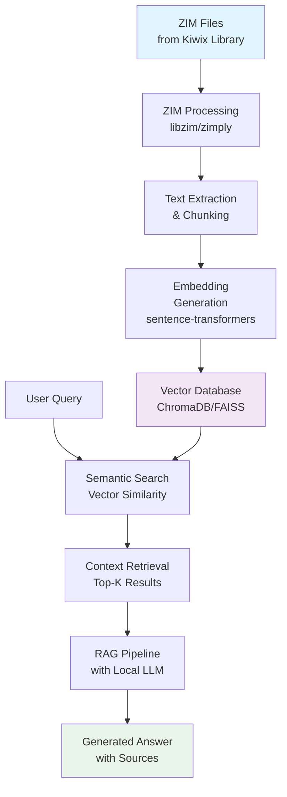

# Dynamic ZIM Library to Vector Database RAG System
This project provides a comprehensive system for processing ZIM files (compressed Wikipedia/offline content databases) and creating a vector database for Retrieval-Augmented Generation (RAG) with Large Language Models, effectively having an offline knowledge base.

This is an good solution for running local LLMs on underpowered computers while providing access to extensive knowledge bases. By leveraging pre-compressed ZIM files and efficient vector search, you can have a powerful AI assistant with encyclopedic knowledge without requiring high-end hardware or constant internet connectivity.

## Architecture Overview


## Features
- **Dynamic ZIM Library**: Automatically discovers and processes multiple ZIM files from a dedicated library directory
- **Multi-format ZIM Support**: Supports libzim, zimply, and CLI-based ZIM file reading
- **Flexible Vector Databases**: Choose between ChromaDB and FAISS for storage
- **Local LLM Support**: Docker Model Runner for offline LLM capabilities
- **Smart Text Processing**: Automatic text chunking and preprocessing with source attribution
- **RAG Pipeline**: Complete retrieval-augmented generation pipeline with multi-source answers
- **CLI Interface**: Easy-to-use command-line interface with library management commands
- **Export Functionality**: Export articles from multiple ZIM files to JSON
- **Source Tracking**: Maintains source information for all extracted content

## Quick Start

### 1. Install Dependencies
```bash
./setup.sh
```

### 2. Add ZIM Files to Library
Download ZIM files from [Kiwix Library](https://library.kiwix.org/) and place them in the `zim_library` directory:

```bash
# Example: Add multiple ZIM files to your library
cp ~/Downloads/*.zim ./zim_library/

# List available ZIM files
python zim_rag.py list-zim
```

### 3. Build Vector Database
> **⚠️ Important Note**: The first build is necessary only once and can take a very long time depending on the ZIM file size and your machine specifications. Large ZIM files (2GB+) may take several hours on slower machines. Subsequent queries will be much faster as they use the pre-built vector database.
```bash
# Build from all ZIM files in library
python zim_rag.py build

# Or build from specific ZIM file
python zim_rag.py build --zim-file "wikipedia_en_medicine_maxi_2023-12.zim"

# Limit articles per ZIM file for faster processing
python zim_rag.py build --limit 1000
```

### 4. Setup Docker Model Runner (Recommended)
This system is configured to automatically use Docker Model Runner with the ai/smollm3:Q4_K_M model for local, offline LLM capabilities.

### 5. Query the Knowledge Base
```bash
# Simple semantic search
python zim_rag.py query "What are treatments for PTSD?"

# Full RAG with LLM generation
python zim_rag.py rag-query "Explain the latest developments in military medicine"

# Get system information
python zim_rag.py info
```

## Commands
### Build Vector Database
```bash
python zim_rag.py build [OPTIONS]

Options:
  --zim-file TEXT    Specific ZIM file to process (optional, processes all if not specified)
  --limit INTEGER    Limit number of articles per ZIM file
  --force            Force rebuild even if vector DB exists
```

### Query Commands
```bash
# Semantic search only
python zim_rag.py query [OPTIONS] QUESTION

Options:
  --k INTEGER        Number of documents to retrieve [default: 5]

# RAG with LLM generation
python zim_rag.py rag-query QUESTION
```

### Library Management Commands
```bash
# List all ZIM files in library
python zim_rag.py list-zim

# Show library and database information
python zim_rag.py info
```

### Export Commands
```bash
# Export articles to JSON
python zim_rag.py export [OPTIONS]

Options:
  --zim-file TEXT    Specific ZIM file to export (optional, exports all if not specified)
  --output TEXT      Output file [default: zim_articles.json]
  --limit INTEGER    Limit number of articles per ZIM file
```

## Configuration
Create a `config.json` file to customize settings:
```json
{
  "zim_library_path": "./zim_library",
  "embedding_model": "all-MiniLM-L6-v2",
  "vector_db_type": "chroma",
  "chunk_size": 1000,
  "chunk_overlap": 200,
  "persist_directory": "./vector_db",
  "collection_name": "zim_articles",
  "llm_provider": "docker_model_runner",
  "llm_model": "ai/smollm3:Q4_K_M",
  "max_articles_per_zim": null
}
```

Use the config file:
```bash
python zim_rag.py --config config.json build
```

## Configuration Options
### Embedding Models
- `all-MiniLM-L6-v2` (fast, good quality)
- `all-mpnet-base-v2` (higher quality, slower)
- `paraphrase-multilingual-MiniLM-L12-v2` (multilingual support)

### Vector Database Types
- `chroma`: ChromaDB (recommended, persistent, metadata-rich)
- `faiss`: FAISS (faster search, less metadata)

### LLM Configuration
This system uses Docker Model Runner for local, offline LLM capabilities with the `ai/smollm3:Q4_K_M` model. The LLM provider is configured in `config.json` and currently supports only Docker Model Runner.

## System Requirements
### Dependencies
- Python 3.8+
- For ZIM reading: libzim or zimply (recommended)
- For embeddings: sentence-transformers
- For vector storage: faiss-cpu or chromadb
- For LLMs: appropriate client libraries

### Hardware Requirements
- **RAM**: 4GB minimum, 8GB+ recommended
- **Storage**: 2-3x the size of your ZIM file for the vector database
- **GPU**: Optional, but recommended for faster embedding generation

## Troubleshooting
### Memory Issues
For large ZIM files:
- Process in batches using `--limit`
- Increase system RAM
- Use smaller chunk sizes
- Consider using FAISS instead of ChromaDB

### Performance Optimization
- Choose appropriate embedding model size
- Adjust chunk size based on content type
- Use FAISS for faster search on large datasets

## ZIM Library Management
### Adding ZIM Files
1. **Download from Kiwix Library**: Visit https://library.kiwix.org/
2. **Place in library directory**: Copy ZIM files to `./zim_library/`
3. **Scan library**: Run `python3 zim_rag.py list-zim` to see available files
4. **Build database**: Run `python3 zim_rag.py build` to process all files

## Examples
### Multi-Source Queries
```bash
# Query across multiple ZIM files
python3 zim_rag.py rag-query "What are the current treatments for PTSD?"

# Get information about programming concepts
python3 zim_rag.py rag-query "Explain machine learning algorithms"

# Research medical and technical topics
python3 zim_rag.py rag-query "How do neural networks relate to brain function?"
```

### Library Management
```bash
# List all available ZIM files
python3 zim_rag.py list-zim

# Process only specific ZIM file
python3 zim_rag.py build --zim-file "wikipedia_en_medicine_maxi_2023-12.zim"

# Get detailed library information
python3 zim_rag.py info
```

### Export and Analysis
```bash
# Export articles from all ZIM files
python3 zim_rag.py export --output all_articles.json

# Export from specific ZIM file
python3 zim_rag.py export --zim-file "fas-military-medicine_en_2025-06.zim" --output military_medicine.json

# Export sample articles
python3 zim_rag.py export --limit 100 --output sample_articles.json
```

### Advanced Build Options
```bash
# Build with different embedding model
python3 zim_rag.py build --embedding-model all-mpnet-base-v2

# Limit articles per ZIM file for faster processing
python3 zim_rag.py build --limit 500

# Force rebuild existing database
python3 zim_rag.py build --force
```

## Contributing
1. Fork the repository
2. Create a feature branch
3. Make your changes
4. Test thoroughly
5. Submit a pull request

For development setup, follow the Quick Start guide above.

## License
This project is open source. Please check the license file for details.

## Support
For issues and questions:
1. Check the troubleshooting section
2. Review the logs in `zim_rag.log`
3. Open an issue with relevant details
